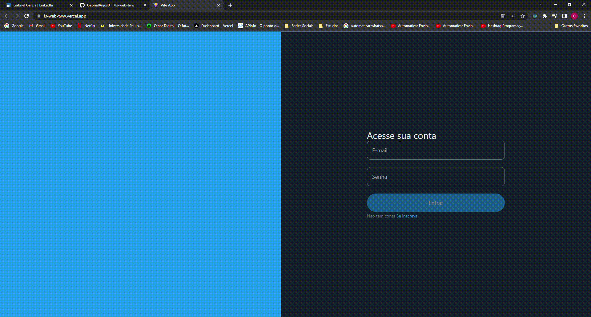

# Clone do twitter

<p align="center">Clone desenvolvido com a biblioteca React, feito para para fazer posts logando com usuario e senha manipulado através de uma API.</p>

Tabela de conteúdos
=================
<p align="center">
 <a href="#Pré-requisitos">Pré-requisitos</a> •
 <a href="#Tecnologias">Tecnologias</a> • 
 <a href="#autor">Autor</a>
</p>

<h1 align="center">
  
</h1>

<h1 id="Pré-requisitos" align="center">Pré-requisitos</h1>

Antes de começar, você vai precisar ter instalado em sua máquina as seguintes ferramentas:
[Git](https://git-scm.com), [Node.js](https://nodejs.org/en/). 
Além disto é bom ter um editor para trabalhar com o código como [VSCode](https://code.visualstudio.com/)

### 🎲 Rodando o Front End (servidor)

```bash
# Clone este repositório
$ git clone <https://github.com/GabrielAnjos011/fs-web-tww.git>

# Acesse a pasta do projeto no terminal/cmd
$ cd fs-web-tww


# Instale as dependências
$ npm install

# Execute a aplicação em modo de desenvolvimento
$ npm run dev:server

# O servidor inciará na porta:3333 - acesse <http://localhost:3333>
```
<h1 id="Tecnologias" align="center">Tecnologias</h1>

As seguintes ferramentas foram usadas na construção do projeto:

- [vitejs](https://vitejs.dev/)
- [Node.js](https://nodejs.org/en/)
- [React](https://pt-br.reactjs.org/)
- [heroicons](https://heroicons.com/)
- [tailwindcss](https://tailwindcss.com/)
- [formik](https://formik.org/docs/overview)
- [axios](https://axios-http.com/ptbr/docs/intro)

<h1 id="autor" align="center">Autor</h1>

Feito com ❤️ por Gabriel Garcia 👋🏽 Entre em contato!

 [](https://www.linkedin.com/in/gabrielgarcia011/) 

[](mailto:gabrielgarcia.anjos250@gmail.com)